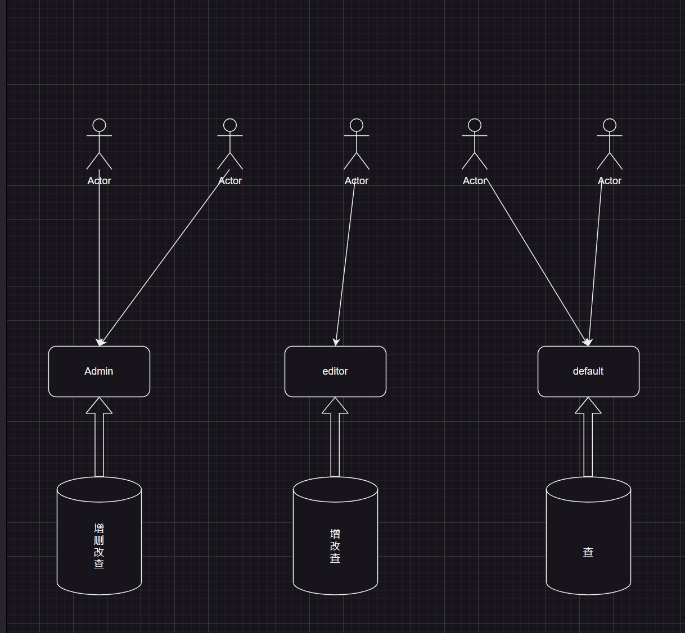
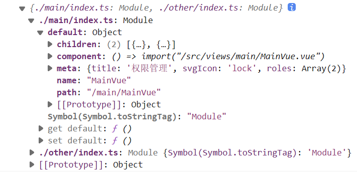

基于 RBAC（Role-Based Access Control）模型的权限访问控制设计

RBAC模型的核心概念：

1. 用户 User

2. 角色 Role ：角色代表了一组具有相似权限需求的用户

3. 权限 Permission：对系统资源进行操作的能力

   

我们只需要给一些角色分配权限，然后将这些角色分配给用户就能实现权限管理控制和动态路由了

**后端只需要给用户信息中添加`roles`字段即可**

首先路由分为常驻路由和动态路由：

常驻路由：

```js
export const constantRoutes: RouteRecordRaw[] = [
	{
		path: "/page1",
		component: () => import("@/pages/page1/CIndex.vue"),
	},
	{
		path: "/page2",
		component: () => import("@/pages/page2/CIndex.vue"),
	},
	{
		path: "/page3",
		component: () => import("@/pages/page3/CIndex.vue"),
	},
];
```

动态路由：

- 配置信息：
  - path：路径
  - component：组件
  - redirect：重定向
  - meta：自定义属性
  - children：子路由

```js
export const asyncRoutes: RouteRecordRaw[] = [
	{
		path: "/permission",
		// component: Layouts,
		redirect: "/permission/page",
		name: "Permission",
		meta: {
			title: "权限管理", //菜单的标题
			svgIcon: "lock", // 菜单的svgIcon
			roles: ["admin", "editor"], // 可以在根路由中设置角色
			alwaysShow: true, // 将始终显示根菜单
		},
		children: [
			{
				path: "page",
				component: () => import("@/views/permission/page.vue"),
				name: "PagePermission",
				meta: {
					title: "页面权限",
					roles: ["admin"], // 或者在子导航中设置角色
				},
			},
			{
				path: "directive",
				component: () => import("@/views/permission/directive.vue"),
				name: "DirectivePermission",
				meta: {
					title: "指令权限", // 如果未设置角色，则表示：该页面不需要权限，但会继承根路由的角色
				},
			},
		],
	},
];
```

~~配置好了路由信息之后，接着就可以进行动态路由匹配了~~

**现在改为只需要再`router/`下写路由信息，并且在`views/`下创建对应的组件即可**

不过在`router`中写路由信息需要注意一点：根路由统一以`index.ts`命名。

因为在配置动态路由信息的时候，是通过`import.meta.global`来获取router下所有的动态路由信息，维护的动态路由表 「`import.meta.global("../router/*/index.ts", { eager: true })`」

```js
const modules = import.meta.glob("../router/*/index.ts", { eager: true });
console.log(modules);
```



然后根据`default`中的信息来渲染相应的页面

根路由统一以`index.ts`来命名的原因：vite在打包的时候，就会把这些路由打成一个包；这在路由比较多的情况下可以提高页面的渲染速度。如果是通过`**/*.ts`来获取所有的路由的话，vite会把一个个路由分成一个小包，一次可能会请求很多个组件，在HTTP中浏览器每次并发的请求最多是6个，多次请求会对服务器造成压力。

```js
const modules: Record<string, any> = import.meta.glob("../router/*/index.ts", { eager: true });
const GetAsyncRoutes = (): RouteRecordRaw[] => {
	return Object.keys(modules).map((item) => {
		const Module = modules[item];
		return Module.default;
	});
};
export const asyncRoutes: RouteRecordRaw[] = GetAsyncRoutes();
```

---

1. `store/modules/user.ts`

主要的逻辑：

- 登录

- 获取用户详情

  ```js
  export const useUserStore = defineStore("user", () => {
  	const token = ref<string>("");
  	const roles = ref<string[]>([]);

  	// 设置角色数组
  	const setRoles = (values: string[]) => {
  		roles.value = values;
  	};

  	/**
  	 * 模拟登录
  	 */
  	const MockLoginApi = (userName: string, passWord: string): Promise<any> => {
  		return new Promise((resolve) => {
  			setTimeout(() => {
  				resolve({
  					data: {
  						userName,
  						passWord,
  						token: "0x12345",
  					},
  				});
  			}, 1000);
  		});
  	};
  	// 登录
  	const login = async (userName: string, passWord: string) => {
  		const { data } = await MockLoginApi(userName, passWord);
  		token.value = data.token;
  	};

  	// 模拟获取用户详情
  	const MockGetInfo = (): any => {
  		return new Promise((resolve) => {
  			resolve({
  				data: {
  					roles,
  				},
  			});
  		});
  	};
  	// 获取用户详情
  	const getInfo = async () => {
  		const { data } = await MockGetInfo();
  		// 验证用户详情中的roles是否为一个空数组，否则塞入一个默认角色
  		roles.value = data.roles?.length > 0 ? data.roles : ["DEFAULT_ROLE"];
  	};
  	return { token, roles, setRoles, login, getInfo };
  });
  ```

登录完成之后 `store` 仓库中保留着用户的 `roles`信息

2. `store/modules/permission.ts`

   主要逻辑：

   - 根据用户的`roles`来匹配动态路由

   ```js
   /**
    * 判断是否有权限
    * @param roles 后端获取用户的roles信息
    * @param route 动态路由中的其中一个路由信息
    * @returns Boolean 是否有这个路由的权限
    */
   const hasPermission = (roles: string[], route: RouteRecordRaw) => {
   	const routeRoles: string[] | undefined = route.meta?.roles as string[] | undefined;
   	return routeRoles ? roles.some((role) => routeRoles.includes(role)) : true; // 为空的话设置默认的角色
   };

   /**
    * 根据角色role筛选路由
    * @param routes 前端配置的动态路由信息 asyncRoutes
    * @param roles 后端获取用户的roles信息
    * @returns 改用户所拥有的权限路由
    */
   const filterAsyncRoutes = (routes: RouteRecordRaw[], roles: string[]) => {
   	const res: RouteRecordRaw[] = [];
   	routes.forEach((route) => {
   		const tempRoute = { ...route };
   		if (hasPermission(roles, tempRoute)) {
   			if (tempRoute.children) {
   				tempRoute.children = filterAsyncRoutes(tempRoute.children, roles);
   			}
   			res.push(tempRoute);
   		}
   	});
   	return res;
   };

   // permission store
   export const usePermissonStore = defineStore("permission", () => {
   	const routes = ref<RouteRecordRaw[]>([]); // 所有路由信息
   	const dynamicRoutes = ref<RouteRecordRaw[]>([]); // 动态路由信息

   	const setRoutes = (roles: string[]) => {
   		const accessdRoutes: RouteRecordRaw[] = filterAsyncRoutes(asyncRoutes, roles);
   		routes.value = constantRoutes.concat(accessdRoutes);
   		dynamicRoutes.value = accessdRoutes;
   	};
   	return { routes, dynamicRoutes, setRoutes };
   });

   ```

完成这两步操作之后，就可以在路由跳转的时候添加路由守卫

```js
router.beforeEach(async (to, from, next) => {
	const userStore = useUserStoreHook();
	const permissionStore = usePermissonStoreHook();

	// 判断该用户是否登录
	if (localCache.getCache("token")) {
		if (to.path === "/login") {
			// 如果已经登录，并准备进入 Login 页面， 则重定向到主页
			next({ path: "/" });
		} else {
			// 检查用户是否已获得其权限角色
			if (userStore.roles.length === 0) {
				try {
					// 角色是一个数组：["admin", "developer"]
					await userStore.getInfo();
					const roles = userStore.roles;
					// 根据角色生成可访问的 Routes (可访问路由 = 常驻路由 + 有访问权限的动态路由)
					permissionStore.setRoutes(roles);
					// 将有权限的动态路由添加到Router中
					permissionStore.dynamicRoutes.forEach((route) => {
						router.addRoute(route);
					});
					// 所有路由加载完毕后
					// 设置 replace
					next({ ...to, replace: true });
				} catch {
					(err: Error) => {
						console.log(err);
						next("/login");
					};
				}
			} else {
				next();
			}
		}
	} else {
		// 没有登录
	}
});
```

按钮权限问题可以自定义`permission`指令，传递该按钮需要的身份role

比如:

```html
<button v-permission=["admin"]></button>
```

说明这个按钮只有`admin`的身份才能看到

`v-permission`指令

```js
/** 权限指令：permission */
export const permission: Directive = {
	mounted(el, binding) {
		// binding：["admin", "developer"]
		const { value: permissionRoles } = binding;
		const { roles } = useUserStoreHook();
		if (Array.isArray(permissionRoles) && permissionRoles.length > 0) {
			const hasPermission = roles.some((role) => permissionRoles.includes(role));
			hasPermission || el.parentNode?.removeChild(el); // 没有权限的话销毁
		} else {
			throw new Error("need roles!");
		}
	},
};
```
